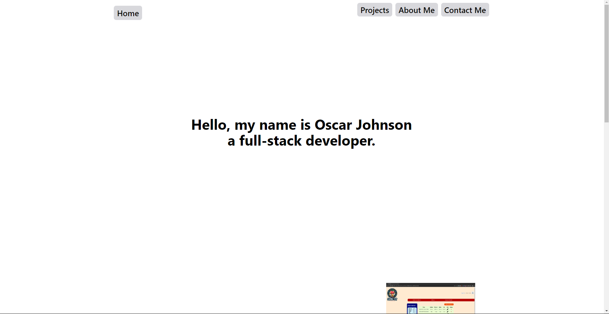

## Personal Website
*This is my personal website I created in 5/1/2024. It was made with Jakarta, Java as the back end and React.js for the front end.*

### Description
Personal website for Oscar Johnson to show help show the projects I have created. 
Also to help give background information about what I have done.
      
### Technology Stack
| Category           | Type         |
|--------------------|--------------|
| Build Tool         | Vite         |
| Front-End Library  | React.js     |
| CSS Framework      | Tailwind CSS |
| Back-End Framework | Jakarta EE   |
| Web Server         | Apache       |
| Database           | MySQL        |
| Unit Testing       | JUnit        |
| Logging Framework  | Log4J        |

### Links
- [User Stories](resources\UserStories.md)
- [Screen Design](resources\wireframes\Personal%20Website%20Wireframe.png)
- [Resources](resources\Resources.md)

### Pictures

